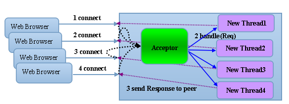
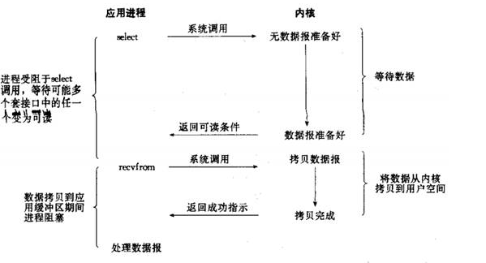
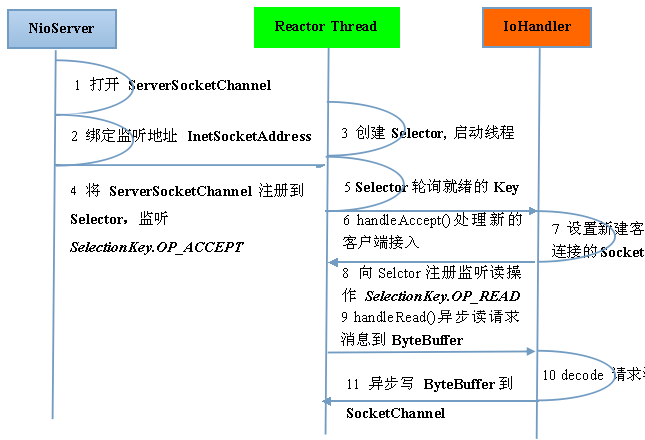
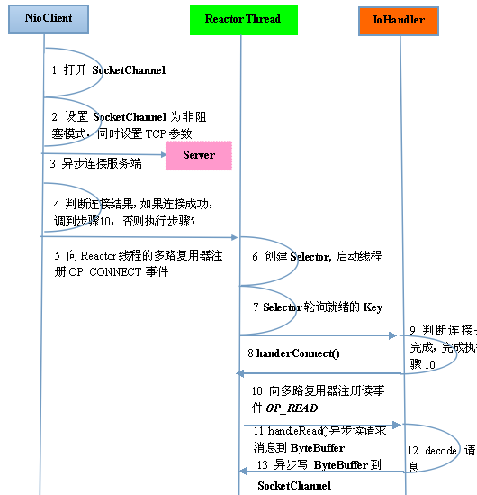

#Netty 学习笔记

## 1. Netty 基础入门

Netty是一个**_高性能，异步事件驱动的NIO框架_**，它提供了对TCP，UDP和文件传输的支持。作为一个异步的NIO框架，Netty中的所有IO操作都是异步阻塞的，通过Future-Listener机制，用户可以主动获取或者通过通过通知机制获取IO操作结果。

## 2.Netty高性能知道

#### 2.1 RPC调用的性能模型分析

**2.1.1. 传统RPC调用性能差的三宗罪**

1. 网络传输方面的问题：传统的RPC框架或基于RMI等方式的远程传输调用采用了**同步阻塞IO**,当客户端的并发压力或者网络时延增大后，同步阻塞IO会由于过于频繁的wait导致IO线程经常性的阻塞，由于线程无法高效地工作，IO处理能力自然下降。

    

   BIO 通信模型图

   采用BIO通信模型的Server端，通常由一个单独的Acceptor线程负责监听Client端的链接，接收到Client端的链接后为Client端创建一个新的线程来处理请求消息，处理完成后，返回应答消息给客户端，然后销毁线程，这是一个典型的**一请求一应答模型**。该架构的最大问题是不具备弹性伸缩的能力，当并发访问量增加后，服务端的线程个数和并发访问的线程数成线性正比，由于线程是JVM非常宝贵的系统资源，当线程数膨胀后，系统的性能也急剧下降，随着并发量的继续增加，可能会发生句柄溢出，线程堆栈溢出等问题，并导致服务器最终宕机。。

2. Java序列化方式问题：

   * Java序列化机制是Java内部的一种对象遍解码技术，**无法跨语言使用**。列入对于异构系统之间的对接，Java序列化后的码流需要能够通过其他语言反序列化成原始对象，目前很难支持。
   * 想对于其他开源的序列化框架,Java序列化后的码流太大，无论是网络传输还是持久化到磁盘，都会导致额外的资源占用；
   * 序列化性能差（CPU资源占用高）

3. 线程模型问题：由于采用同步阻塞IO，这回导致每个TCP连接都占用1个线程，由于线程资源是JVM虚拟机中非常宝贵的资源，当IO读写阻塞导致线程无法顺利释放是，会导致性能急剧下降，严重时甚至会导致虚拟机无法创建新的线程。

**2.1.2 高性能的三个主题**

* 传输：用什么样的通道将数据传输给对方，BIO，NIO或者AIO；
* 协议：采用什么样的通信协议，HTTP或者内部私有协议。协议的选择不同，性能模式也不同。相对于公有协议，内部私有协议通常可以被设计的更优；
* 线程：数据报如何读取？读取后的编程码在哪个线程中进行，编解码后的消息如何派发，Reactor线程模型的不同，对性能的影响也非常大。   

#### 2.2 Netty高性能之道

**2.2.1 异步非阻塞通信**

在IO编程过程中，当需要同时处理多个客户端接入请求时，可以利用多线程或者IO多路复用技术进行处理。**_IO多路复用技术_** 通过**把多个IO的阻塞复用到同一个Selector的阻塞上**，从而使得系统**在单线程的情况下可以同时处理多个客户端的请求**。与传统的多线程/多进程模型相比，I/O多路复用的最大优势是系统开销小，系统不需要创建新的额外进程或者线程，而不需要维护这些进程和线程的运行，降低了系统的维护工作量，节省了系统资源。

JDK NIO通信模式如下：

 

与Socket类和SocketServer类相对应，NIO也提供了SocketChannel与ServerSocketChannel两种不同的套接字通道实现。这两种新增的通道都支持阻塞和非阻塞两种模式。阻塞模式使用非常简单，但是性能和可靠性都不好，非阻塞模式正好相反。开发人员一般可以根据自己的需要来选择合适的模式，一般来说，低负载、低并发的应用程序可以选择同步阻塞IO以降低编程复杂度。但是对于高负载、高并发的网络应用，需要使用NIO的非阻塞模式进行开发。

Netty架构按照Reactor模式设计和实现，服务端的通信序列图如下：

 

Netty客户端通信序列图如下：

 

Netty的IO线程NioEventLoop由于**聚合了多路复用器Selector，可以同时并发处理成百上千个客户端Channel，由于读写操作都是非阻塞的**，这就可以充分提升IO线程的运行效率，避免由于频繁的IO阻塞导致的线程挂起。除此之外，由于**Netty采用了异步通信模式，一个IO线程可以并发处理N个客户端连接和读写操作**，这也从根本上解决了传统同步阻塞IO一连接一线程模型，架构的性能，弹性伸缩能力和可靠性都有了极大的提升。

**2.2.2 零拷贝**