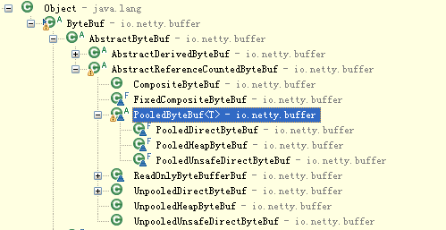

#Netty 学习笔记


## 1. Netty 基础入门

Netty是一个**_高性能，异步事件驱动的NIO框架_**，它提供了对TCP，UDP和文件传输的支持。作为一个异步的NIO框架，Netty中的所有IO操作都是异步阻塞的，通过Future-Listener机制，用户可以主动获取或者通过通过通知机制获取IO操作结果。


## 2.Netty高性能知道

#### 2.1 RPC调用的性能模型分析

**2.1.1. 传统RPC调用性能差的三宗罪**

1. 网络传输方面的问题：传统的RPC框架或基于RMI等方式的远程传输调用采用了**同步阻塞IO**,当客户端的并发压力或者网络时延增大后，同步阻塞IO会由于过于频繁的wait导致IO线程经常性的阻塞，由于线程无法高效地工作，IO处理能力自然下降。

    

   BIO 通信模型图

   采用BIO通信模型的Server端，通常由一个单独的Acceptor线程负责监听Client端的链接，接收到Client端的链接后为Client端创建一个新的线程来处理请求消息，处理完成后，返回应答消息给客户端，然后销毁线程，这是一个典型的**一请求一应答模型**。该架构的最大问题是不具备弹性伸缩的能力，当并发访问量增加后，服务端的线程个数和并发访问的线程数成线性正比，由于线程是JVM非常宝贵的系统资源，当线程数膨胀后，系统的性能也急剧下降，随着并发量的继续增加，可能会发生句柄溢出，线程堆栈溢出等问题，并导致服务器最终宕机。。

2. Java序列化方式问题：

   * Java序列化机制是Java内部的一种对象遍解码技术，**无法跨语言使用**。列入对于异构系统之间的对接，Java序列化后的码流需要能够通过其他语言反序列化成原始对象，目前很难支持。
   * 想对于其他开源的序列化框架,Java序列化后的码流太大，无论是网络传输还是持久化到磁盘，都会导致额外的资源占用；
   * 序列化性能差（CPU资源占用高）

3. 线程模型问题：由于采用同步阻塞IO，这回导致每个TCP连接都占用1个线程，由于线程资源是JVM虚拟机中非常宝贵的资源，当IO读写阻塞导致线程无法顺利释放是，会导致性能急剧下降，严重时甚至会导致虚拟机无法创建新的线程。


**2.1.2 高性能的三个主题**

* 传输：用什么样的通道将数据传输给对方，BIO，NIO或者AIO；
* 协议：采用什么样的通信协议，HTTP或者内部私有协议。协议的选择不同，性能模式也不同。相对于公有协议，内部私有协议通常可以被设计的更优；
* 线程：数据报如何读取？读取后的编程码在哪个线程中进行，编解码后的消息如何派发，Reactor线程模型的不同，对性能的影响也非常大。   

#### 2.2 Netty高性能之道

**2.2.1 异步非阻塞通信**

在IO编程过程中，当需要同时处理多个客户端接入请求时，可以利用多线程或者IO多路复用技术进行处理。**_IO多路复用技术_** 通过**把多个IO的阻塞复用到同一个Selector的阻塞上**，从而使得系统**在单线程的情况下可以同时处理多个客户端的请求**。与传统的多线程/多进程模型相比，I/O多路复用的最大优势是系统开销小，系统不需要创建新的额外进程或者线程，而不需要维护这些进程和线程的运行，降低了系统的维护工作量，节省了系统资源。

JDK NIO通信模式如下：

 

与Socket类和SocketServer类相对应，NIO也提供了SocketChannel与ServerSocketChannel两种不同的套接字通道实现。这两种新增的通道都支持阻塞和非阻塞两种模式。阻塞模式使用非常简单，但是性能和可靠性都不好，非阻塞模式正好相反。开发人员一般可以根据自己的需要来选择合适的模式，一般来说，低负载、低并发的应用程序可以选择同步阻塞IO以降低编程复杂度。但是对于高负载、高并发的网络应用，需要使用NIO的非阻塞模式进行开发。

Netty架构按照Reactor模式设计和实现，服务端的通信序列图如下：

 

Netty客户端通信序列图如下：

 

Netty的IO线程NioEventLoop由于**聚合了多路复用器Selector，可以同时并发处理成百上千个客户端Channel，由于读写操作都是非阻塞的**，这就可以充分提升IO线程的运行效率，避免由于频繁的IO阻塞导致的线程挂起。除此之外，由于**Netty采用了异步通信模式，一个IO线程可以并发处理N个客户端连接和读写操作**，这也从根本上解决了传统同步阻塞IO一连接一线程模型，架构的性能，弹性伸缩能力和可靠性都有了极大的提升。


**2.2.2 零拷贝**

Netty零拷贝主要体现在如下3方面：

1. Netty的接收和发送ByteBuffer采用DIRECT BUFFERS, 使用堆外直接内存进行Socket读写，不需要进行字节缓冲区的二次拷贝。如果使用传统的堆内存(HEAP BUFFERS)进行Socket读写，JVM会将堆内存Buffer拷贝一份到直接内存，然后才写入到Socket中。相比于堆外直接内存，消息在发送过程中多了一次缓冲区的内存拷贝；
2. Netty提供了组合Buffer对象，可以聚合多个ByteBuffer对象，用户可以像操作一个Buffer那样方便的对组合Buffer进行操作，避免了传统通过内存拷贝的方式将几个小Buffer合并成一个大的Buffer。
3. Netty的文件传输采用了transferTo方法，它可以直接将文件缓存区的数据发送到目标Channel，避免了传统通过循环write方法导致的内存拷贝问题。   

——————— to be continue


**2.2.3 内存池**

随着JVM虚拟机和JIT即时编译技术的发展，对象的分配和回收是个非常轻量级的工作。但是对于缓冲区Buffer，情况却稍有不同，特别是对于堆外直接内存的分配和回收，是一件耗时的操作。为了尽量重用缓冲区，Netty提供了基于内存池的缓冲区重用机制。下面我们一起看下Netty ByteBuf的实现：

 

内存池 ByteBuf

Netty提供了多种内存管理策略，通过在启动辅助类中配置相关参数，可以实现差异化的定制。

可以通过以下的性能测试来看下基于内存池循环利用ByteBuf和普通ByteBuf的性能差异

用例一，使用内存是分配器创建直接内存缓冲区

```java
int loop = 300000000;
long startTime = System.currentTimeMillis();
ByteBuf poolBuffer = null;
for (int i=0; i<loop; i++) {
  poolBuffer = PooledByteBufAllocator.DEFAULT.directBuffer(1024);
  poolBuffer.writeBytes(CONTENT);
  poolBuffer.release();
}
```

用例二，使用费堆内存分配器创建的直接内存缓冲区

```java
long startTime2 = System.currentTimeMillis();
ByteBuf buffer = null;
for(int i = 0; i < loop; i++) {
  buffer = Unpooled.directBuffer(1024);
  buffer.writeBytes(CONTENT);
}
```


**2.2.4 高效地Reactor线程模型**

常用的Reactor线程模型有3种：

1. Reactor单线程模式；
2. Reactor多线程模式；
3. 主从Reactor多线程模式；

Reactor单线程模式，指的是所有的IO操作都在同一个NIO线程上面完成，NIO线程的之策如下：

* 作为NIO服务端，接受客户端的TCP连接；
* 作为NIO服务端，向服务端发起TCP连接；
* 读取通信对端的请求或者应答消息；
* 想通信对端发起消息请求或应答消息；

Reactor线程模型示意图如下

 

由于Reactor模式使用的是异步非阻塞IO，所有的IO操作都不会导致阻塞，理论上一个线程可以独立处理所有IO相关的操作。从架构层面上看，一个NIO线程的确可以完成其承担的责任。例如，通过Acceptor接收客户端的TCP连接请求消息，链路建立成功之后，通过Dispatch将对应的ByteBuffer派发到指定的Handler上进行消息解码。用户Handler可以通过NIO线程将消息发送给客户端。

对于一些小容量的应用场景可以使用单线程模型。但对于高负载，大并发的应用却并不合适，原因如下：

* 一个NIO线程同时处理一个NIO线程同时处理成百上千的链路，性能上无法支撑，即便NIO线程的CPU负荷达到100%，也无法满足海量消息的编码、解码、读取和发送；
* 当NIO线程负载过重之后，处理速度将变慢，这会导致大量客户端连接超时，超时之后往往会进行重发，这更加重了NIO线程的负载，最终会导致大量消息积压和处理超时，NIO线程会成为系统的性能瓶颈；
* 可靠性问题：一旦NIO线程意外跑飞，或者进入死循环，会导致整个系统通信模块不可用，不能接收和处理外部消息，造成节点故障。

为了解决这些问题，演进出了Reactor多线程模式。

Reactor多线程模式与但线程模式最大的区别就是有一组NIO线程处理IO操作，原理图如下：

 

Reactor多线程模式的特点：

* 有专门的一个NIO线程-Acceptor线程用于监听服务端，接受客户端的TCP连接请求；
* 网络IO操作-读、写等由一个NIO线程池负责，线程池可以采用标准的JDK线程池实现，它包含一个任务队列和N个可用的线程，由这些NIO线程负责消息的读取、解码、编码和发送；
* 1个NIO线程可以同时处理N条链路，但是1个链路只对应1个NIO线程，防止发生并发操作问题。

在绝大多数场景下，Reactor多线程模型都可以满足性能需求；但是，在极特殊应用场景中，一个NIO线程负责监听和处理所有的客户端连接可能会存在性能问题。例如百万客户端并发连接，或者服务端需要对客户端的握手消息进行安全认证，认证本身非常损耗性能。在这类场景下，单独一个Acceptor线程可能会存在性能不足问题，为了解决性能问题，产生了第三种Reactor线程模型-主从Reactor多线程模型。

主从Reactor线程模型的特点是：服务端用于接收客户端连接的不再是个1个单独的NIO线程，而是一个独立的NIO线程池。Acceptor接收到客户端TCP连接请求处理完成后（可能包含接入认证等），将新创建的SocketChannel注册到IO线程池（sub reactor线程池）的某个IO线程上，由它负责SocketChannel的读写和编解码工作。Acceptor线程池仅仅只用于客户端的登陆、握手和安全认证，一旦链路建立成功，就将链路注册到后端subReactor线程池的IO线程上，由IO线程负责后续的IO操作。

主从Reactor线程模型如下图所示：

 

利用主从NIO线程模型，可以解决一个服务端监听线程无法有效处理所有客户端连接的性能不足问题。

事实上，Netty的线程模型并非固定不变，通过在启动辅助类中创建不同的EventLoopGroup实例并通过适当的参数配置，就可以支持上述三种Reactor线程模型。正是因为Netty 对Reactor线程模型的支持提供了灵活的定制能力，所以可以满足不同业务场景的性能诉求。


**2.2.5 无锁化得串行设计理念**

在大多数场景下，并行多线程处理可以提升系统的并发性能。但是，如果对于共享资源的并发访问处理不当，会带来严重的锁竞争，这最终会导致性能的下降。为了尽可能的避免锁竞争带来的性能损耗，可以通过串行化设计，即消息的处理尽可能在同一个线程内完成，期间不进行线程切换，这样就避免了多线程竞争和同步锁。

为了尽可能提升性能，Netty采用了串行无锁化设计，在IO线程内部进行串行操作，避免多线程竞争导致的性能下降。表面上看，串行化设计似乎CPU利用率不高，并发程度不够。但是，通过调整NIO线程池的线程参数，可以同时启动多个串行化的线程并行运行，这种局部无锁化的串行线程设计相比一个队列-多个工作线程模型性能更优。

Netty的串行化设计工作原理图如下：

 

Netty的NioEventLoop读取到消息之后，直接调用ChannelPipeline的fireChannelRead(Object msg)，只要用户不主动切换线程，一直会由NioEventLoop调用到用户的Handler，期间不进行线程切换，这种串行化处理方式避免了多线程操作导致的锁的竞争，从性能角度看是最优的。


**2.2.6 高效地并发编程**

Netty的高效并发编程主要体现在如下几点：

1) volatile的大量、正确使用;

2) CAS和原子类的广泛使用；

3) 线程安全容器的使用；

4) 通过读写锁提升并发性能。


**2.2.7 高性能的序列化框架**

影响序列化性能的关键因素总结如下：

1) 序列化后的码流大小（网络带宽的占用）；

2) 序列化&反序列化的性能（CPU资源占用）；

3) 是否支持跨语言（异构系统的对接和开发语言切换）。

Netty默认提供了对Google Protobuf的支持，通过扩展Netty的编解码接口，用户可以实现其它的高性能序列化框架，例如Thrift的压缩二进制编解码框架。


**2.2.8 灵活的TCP参数配置能力**

合理设置TCP参数在某些场景下对于性能的提升可以起到显著的效果，例如SO_RCVBUF和SO_SNDBUF。如果设置不当，对性能的影响是非常大的。下面我们总结下对性能影响比较大的几个配置项：

1) SO_RCVBUF和SO_SNDBUF：通常建议值为128K或者256K；

2) SO_TCPNODELAY：NAGLE算法通过将缓冲区内的小封包自动相连，组成较大的封包，阻止大量小封包的发送阻塞网络，从而提高网络应用效率。但是对于时延敏感的应用场景需要关闭该优化算法；

3) 软中断：如果Linux内核版本支持RPS（2.6.35以上版本），开启RPS后可以实现软中断，提升网络吞吐量。RPS根据数据包的源地址，目的地址以及目的和源端口，计算出一个hash值，然后根据这个hash值来选择软中断运行的cpu，从上层来看，也就是说将每个连接和cpu绑定，并通过这个hash值，来均衡软中断在多个cpu上，提升网络并行处理性能。

Netty在启动辅助类中可以灵活的配置TCP参数，满足不同的用户场景。相关配置接口定义如下：

 